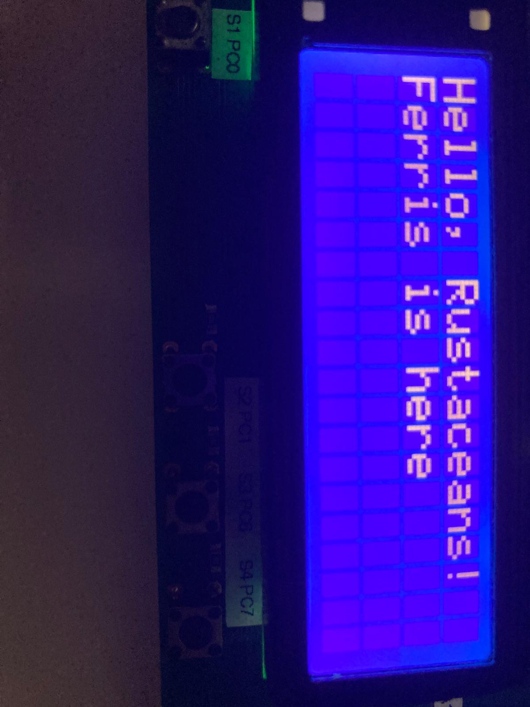

# dip203-driver

[](https://crates.io/crates/dip203-driver)
[](LICENSE-MIT.txt)

A `no_std` Rust driver for DIP203 compliant LCD displays using the `embedded-hal` v1.0.0 traits.

## Features

- **`no_std` compatible:** Designed for bare-metal embedded systems.
- **`embedded-hal` 1.0 support:** Uses the latest stable embedded hardware abstraction layer (`SpiDevice`, `DelayNs`).
- Simple API for writing text to specific lines and positions.
  
## Interface support

- Supported: **SPI**
- Not supported: I²C (and other interfaces)

## Installation

Add this to your `Cargo.toml`:

```toml
[dependencies]
dip203-driver = "0.1.0"
```

## Usage

Here is a basic example of how to initialize the display and print some text. 

```rust
use dip203_driver::{DIP203, Line, Position};

// Assuming you have initialized your SPI and Delay using your HAL
// let spi = ...;
// let delay = ...;

// Initialize the display
let mut lcd = DIP203::new(spi, delay).expect("Failed to initialize LCD");

// Print a message to the first line, starting at the first character position
lcd.print(Line::First, Position::First, "Hello, Rustaceans!").unwrap();
lcd.print(Line::Second, Position::First, "Ferris is here").unwrap();

// Clear the screen
// lcd.clear();
```

 

## Running the Example

This repository contains an example (`demo`) that uses the `embassy-stm32` framework. Because the example is written for an ARM Cortex-M microcontroller (specifically the `stm32l100rc`), you cannot build the example for your host machine (x86_64). 

You must specify the target architecture when compiling the example:

```bash
# First, ensure you have the correct target installed
rustup target add thumbv7m-none-eabi

# Build the example for the embedded target
cargo build --example demo --target thumbv7m-none-eabi
```

*(Note: The library itself is architecture-agnostic and can be checked on your host machine simply using `cargo build`.)*

## License

Licensed under either of

- Apache License, Version 2.0 ([LICENSE-APACHE](LICENSE-APACHE) or http://www.apache.org/licenses/LICENSE-2.0)
- MIT license ([LICENSE-MIT](LICENSE-MIT) or http://opensource.org/licenses/MIT)
